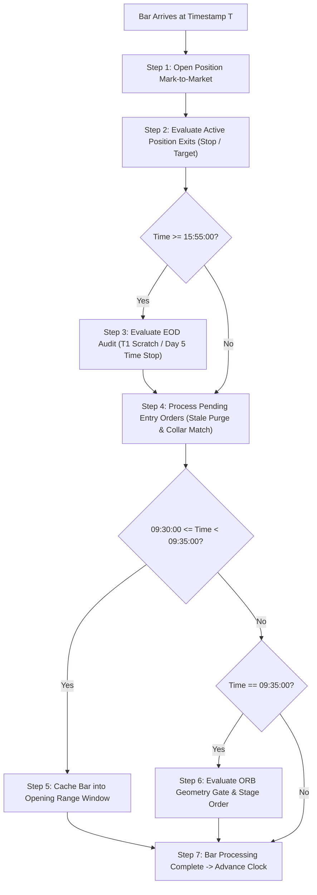

# Stage 0.1 Event-Ordering & Intrabar Precedence Audit

**Repository:** `C:\work\projects\bonde-strategy`  
**Evaluation Scope:** Chronological Invariants, Intrabar Multi-Event Collisions, and Resolution Precedence  
**Date:** September 2026  
**Status Standard:** `PASS` | `ASSUMPTION DOCUMENTED` | `FAIL`  

---

## 1. Executive Summary

In a discrete-time 1-minute OHLCV backtest engine, a single 1-minute bar aggregates up to hundreds or thousands of real-market ticks. When multiple trade events become eligible within the same 1-minute bar, deterministic precedence rules must govern execution to prevent optimistic fill bias or non-reproducible outcomes.

This audit documents the exact precedence hierarchy implemented in [`Stage0BacktestEngine`](file:///C:/work/projects/bonde-strategy/src/bonde/engine/backtest.py) and [`ExecutionSimulator`](file:///C:/work/projects/bonde-strategy/src/bonde/execution/simulator.py), isolates known ambiguities, and defines the structural assumptions required for Stage 1.

---

## 2. Master Event Processing Pipeline (Per Bar)

For every canonical 1-minute bar $B_t$ at timestamp $T$, the engine executes events in the following deterministic sequence:

---

## 3. Multi-Event Collision Analysis & Precedence Hierarchy

### 3.1 Scenario: Target + Stop Collision on Same Bar (Rule D2)
* **Precondition:** Position is active; bar reaches both `low <= current_stop` AND `high >= partial_target`.
* **Deterministic Precedence:** **STOP FIRST (Invariant D2)**.
* **Execution Price:** `min(current_stop, bar.open)`.
* **Rationale:** In the absence of sub-minute tick order, the engine enforces the most conservative outcome (loss realized, target disregarded).
* **Status:** **PASS (Deterministic & Tested)**.

---

### 3.2 Scenario: Gap Through Stop Loss
* **Precondition:** Bar opens below active stop (`bar.open < current_stop`).
* **Deterministic Precedence:** **STOP FILLED AT OPEN PRINT**.
* **Execution Price:** `min(current_stop, bar.open)` = `bar.open`.
* **Rationale:** Realistic adverse gap modeling. In live trading, a stop market order placed at $48.00 will execute at the first available trade ($46.50) when the market gaps down.
* **Status:** **PASS (Deterministic & Tested)**.

---

### 3.3 Scenario: Opening Price Above Stop-Limit Collar (Collar Miss)
* **Precondition:** Pending `BUY_STOP_LIMIT` order staged with Trigger $T$ and Limit $L = T + \$0.10$. Bar opens above limit (`bar.open > L`).
* **Deterministic Precedence:** **ORDER CANCELLED IMMEDIATELY (`COLLAR_MISS`)**.
* **Execution Price:** None (No fill, no chasing).
* **Rationale:** Mandated by Section 11 of the Unified Algorithmic Specification ("Anti-Chasing Law").
* **Status:** **PASS (Deterministic & Tested)**.

---

### 3.4 Scenario: Order Cancellation at Exactly 10:15:00 EST
* **Precondition:** Pending order remains unfilled at 10:14:59. Next incoming bar is stamped `10:15:00`.
* **Deterministic Precedence:** **STALE ORDER PURGE PRECEDES PRICE TRIGGER**.
* **Execution Logic:** `if bar_time >= self.stale_order_time: order.cancel("STALE_ORDER_PURGE"); return None`.
* **Rationale:** The order expires at the start of the 10:15:00 bar. Even if `bar.high >= trigger_price` on the 10:15:00 bar, the order is cancelled before evaluating the price.
* **Status:** **PASS (Deterministic & Tested)**.

---

### 3.5 Scenario: EOD Liquidation (03:55 PM EST)
* **Precondition:** Position entered on Day 1 ($T_1$) closes at or below entry price (`bar.close <= position.entry_price`) at 15:55:00 EST.
* **Deterministic Precedence:** **EOD AUDIT LIQUIDATION AT 15:55 BAR CLOSE**.
* **Execution Price:** `bar.close`.
* **Rationale:** Liquidated before normal session auction close (16:00:00) to protect capital against overnight gap risk.
* **Status:** **PASS (Deterministic & Tested)**.

---

### 3.6 Scenario: Partial Exit (+2R) Followed by Breakeven Stop on Subsequent Bars
* **Precondition:** Position touches $+2.0\text{R}$ target on Bar $t_1$.
* **Execution Sequence:**
  1. Bar $t_1$: 50% position liquidated at target price (`partial_target`).
  2. Remaining stop immediately ratcheted to Breakeven (`Entry + $0.01`).
  3. `is_cushioned = True` unlocks portfolio and sector risk capacity.
  4. Bar $t_2$: If `bar.low <= Entry + $0.01`, runner is stopped out at Breakeven.
* **Status:** **PASS (Deterministic & Tested)**.

---

## 4. Unresolved Intrabar Ambiguities (Documented Assumptions)

The following scenarios cannot be determined from 1-minute OHLC bars alone without making explicit structural assumptions:

### Ambiguity A: Same-Bar Entry Trigger + Stop Loss Breach
* **Condition:** A pending Buy Stop order is triggered by `bar.high >= trigger_price`, but the same 1-minute bar also registers `bar.low <= stop_price`.
* **Physical Reality:**
  - Case 1: Stock dipped to `low`, then rallied through `trigger` to `high` and closed strong. (Order filled; stop was never touched after entry).
  - Case 2: Stock spiked through `trigger` to `high`, then collapsed through `stop` to `low`. (Order filled and immediately stopped out).
* **Current Stage 0 Implementation:** `_evaluate_position_exits` runs at Step 2 (before `_process_pending_orders` at Step 4). Therefore, newly filled positions do not evaluate exits on the entry bar itself; exit evaluation begins on bar $t+1$.
* **Audit Finding:** If a stock triggers entry and collapses below stop within the very same 1-minute bar, and the next bar opens above the stop, the stop violation on the entry bar is currently bypassed.
* **Formal Structural Assumption for Stage 1:** 
  > **Assumption A1 (Conservative Entry-Bar Exit Evaluation):** For any position filled on Bar $t$, if `bar.low <= order.stop_loss_price`, the engine should evaluate the stop exit on Bar $t$ immediately post-fill under the conservative D2 principle, unless 1-second or tick data resolves the exact intrabar sequence.

---

### Ambiguity B: Intrabar Price Sweep Past Collar
* **Condition:** Bar opens below trigger (`bar.open < trigger`), but bar high exceeds limit collar (`bar.high > limit_price`).
* **Physical Reality:** Did price trade through the collar in an orderly auction (allowing a fill between `trigger` and `limit`), or did a single block trade jump directly past the limit?
* **Current Stage 0 Implementation:** Assumes continuous execution at `trigger_price` (plus slippage from `SlippageModel`), provided `bar.open <= limit_price`.
* **Formal Structural Assumption for Stage 1:**
  > **Assumption A2 (Orderly Intrabar Sweep):** On 1-minute bars where `open <= limit`, price is assumed to have traded through the trigger and filled within the allowable collar, subject to configured execution slippage.

---

## 5. Event-Ordering Status Summary

**STAGE 0.1 EVENT-ORDERING STATUS: PASS WITH EXPLICIT ASSUMPTIONS DOCUMENTED.**  
The discrete pipeline guarantees deterministic, repeatable execution order. All OHLC ambiguities are formally isolated rather than silently resolved.
