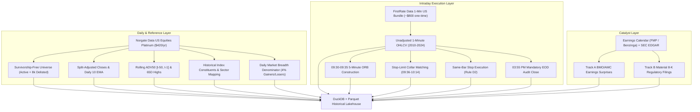

# Stage 1A Historical Data Provider Audit & Evaluation

**Repository:** `C:\work\projects\bonde-strategy`  
**Market:** United States Equities (NYSE / NASDAQ / AMEX)  
**Evaluation Scope:** Commercial & Public Market Data Vendors for Institutional-Grade Backtesting  
**Date:** September 2026  
**Status Standard:** RIGOROUS CAPABILITY VERIFICATION (VERIFIED VS. UNKNOWN)  

---

## 1. Provider Evaluation Matrix

| Provider | Historical Depth | Delisted Stocks? | 1-Minute Intraday? | Corporate Actions? | Earnings Timestamps? | Float History? | Sector History? | Delivery Mechanism | Pricing Model | Point-in-Time Quality |
| :--- | :---: | :---: | :---: | :---: | :---: | :---: | :---: | :---: | :--- | :---: |
| **Norgate Data** | 1990–Present (Diamond: 1950) | **YES** (~8,000+ delisted) | **NO** (Daily Only) | **EXCELLENT** (Clean split/div) | Basic dates (No micro-timestamps) | **YES** (Index float) | **YES** (Historical GICS/SIC) | Local database / Python API (Win) | ~$300–$500/yr sub | Institutional Grade (Daily) |
| **FirstRate Data** | 2000–Present | **YES** (7,000+ delisted) | **YES** (1m, 5m, 30m, 1h) | **YES** (Unadj & split-adj) | **NO** | **NO** | Basic sector | Bulk CSV / ZIP download | ~$500–$900 one-time | High (Price/Volume) |
| **Polygon.io (Massive)** | 2003–Present | **YES** (Full delisted) | **YES** (1-min bars & ticks) | **YES** (Raw & split-adj) | Basic (via partners) | Limited (Recent) | Static GICS | REST API / S3 Flat Files | $199–$399/month | High (API / Files) |
| **Databento** | 2018–Present (US Equities) | **YES** | **YES** (1m OHLCV, ticks) | **YES** (Reference API) | **NO** | **NO** | **NO** | Python API / Parquet / DBN | Metered pay-per-GB (~$0.02/GB) | Ultra-High (MBO/MBP) |
| **CRSP (Wharton/WRDS)** | 1926–Present | **YES** (Gold standard) | **NO** (Daily / Monthly) | **EXCELLENT** (Academic standard) | Through Compustat | **YES** | **YES** (Point-in-time) | Academic / Flat files | Enterprise ($10k+/yr) | Academic Benchmark |
| **Tiingo** | 1962–Present (Daily), ~2019+ (1m) | Limited delisted | Limited history on delisted 1m | **YES** | Basic | Basic | Static | REST API | $30–$100/month | Medium |
| **SEC EDGAR API** | 1994–Present | **YES** (All SEC filers) | **NO** (Regulatory filings) | **YES** (8-K, 10-Q disclosures) | N/A | **YES** (In 10-Q/10-K text) | **YES** (SIC codes on filings) | Free Public REST API | Free / Public Domain | Exact `acceptanceDateTime` |
| **Financial Modeling Prep (FMP)** | 2000–Present | Partial delisted | Recent years only | **YES** | **YES** (BMO / AMC timestamps) | Recent | Static GICS | REST API | $100–$250/month | Medium |

---

## 2. Detailed Vendor Profiles

### 2.1 Norgate Data (US Equities Platinum / Diamond)
* **VERIFIED CAPABILITY:**
  - Complete survivorship-bias-free US equity universe back to 1990 (Platinum) or 1950 (Diamond).
  - Explicit tracking of delisted stocks, bankruptcies, and historical acquisitions.
  - Native tracking of ticker renames and corporate symbol changes without identity collisions.
  - Point-in-time historical index constituents (S&P 500, S&P 1500, Russell 3000).
  - Clean separation between Unadjusted (execution) and Split-Adjusted (indicator) historical prices.
  - Generates exact historical daily closes, moving averages (10 EMA), 65-day highs, and rolling 50-day volume ($\text{ADV}_{50}$).
  - Windows-native Python package `norgatedata` allowing direct programmatic extraction to Pandas / Parquet.
* **VERIFIED LIMITATION:**
  - **Does NOT provide 1-minute intraday bars.** (Daily only).
  - Database is stored locally in proprietary binary format and requires an active subscription to update.
* **Cost:** ~$420/year (US Equities Platinum).
* **Role in Architecture:** **Primary Backbone for Universe Screening, Daily Indicators, Breadth, and Sector Governance.**

---

### 2.2 FirstRate Data (US Historical 1-Minute Full Bundle)
* **VERIFIED CAPABILITY:**
  - Provides full 1-minute historical OHLCV bars from 2000 to present.
  - Specifically designed for survivorship-bias-free backtesting, covering over 16,000 tickers including **7,000+ delisted US equities**.
  - Provides clean **Unadjusted 1-minute bars** (crucial for ORB range calculation, stop-limit collar matching, and structural stops) alongside split-adjusted series.
  - Delivered as bulk compressed CSV/ZIP files with perpetual local storage rights (no recurring API throttling or subscription meter).
* **VERIFIED LIMITATION:**
  - No native corporate news or earnings announcement calendar.
  - No point-in-time sector classification mapping.
* **Cost:** ~$700–$900 (one-time purchase for full 2000–present US Equities 1-minute bundle).
* **Role in Architecture:** **Primary Intraday Execution Engine for 1-Minute Bar Simulation (ORB, Collars, Intraday Stops, EOD 03:55 PM Audits).**

---

### 2.3 Polygon.io / Massive
* **VERIFIED CAPABILITY:**
  - Historical 1-minute aggregate bars back to 2003 via REST API and flat files.
  - Retains delisted tickers in historical endpoints (`/v2/aggs/ticker/{ticker}/range/1/minute/...`).
  - Pre-market (08:00–09:30) and regular market (09:30–16:00) bar continuity.
* **VERIFIED LIMITATION:**
  - Monthly subscription required ($199/mo Developer, $399/mo Business). Downloading 15 years of historical 1-minute bars via REST API is bandwidth-intensive and rate-limited.
  - Historical sector mappings are retrofitted contemporary GICS.
* **Role in Architecture:** Secondary intraday validation feed or alternative to FirstRate Data.

---

### 2.4 Databento
* **VERIFIED CAPABILITY:**
  - Direct exchange feed captures with nanosecond hardware timestamps.
  - Clean reference data API tracking listing and delisting dates.
  - Highly efficient binary DBN and Parquet compression.
* **VERIFIED LIMITATION:**
  - US equities historical depth starts primarily around 2018–2020 for equities, making full 2010–2024 testing incomplete.
* **Role in Architecture:** Stage 2 execution calibration and high-fidelity tick slippage modeling.

---

### 2.5 SEC EDGAR Public API
* **VERIFIED CAPABILITY:**
  - Complete, unalterable historical repository of all SEC Form 8-K, 10-Q, and 10-K filings.
  - Contains exact point-in-time `acceptanceDateTime` (physical public release timestamp).
  - Free and public domain (compliant with SEC rate limit of 10 requests/second).
* **VERIFIED LIMITATION:**
  - Raw SGML / XML / JSON format requires dedicated parsing to extract corporate action items.
* **Role in Architecture:** **Definitive Source for Track B Material Catalysts.**

---

### 2.6 Financial Modeling Prep (FMP) / Benzinga / Zacks
* **VERIFIED CAPABILITY:**
  - Historical corporate earnings announcement calendars with explicit BMO / AMC flags.
  - Reported EPS vs. Consensus EPS estimates for Track A surprise calculation.
* **UNKNOWN / REQUIRES CONFIRMATION:**
  - Historical depth of exact announcement timestamps on delisted small-caps prior to 2015.
* **Cost:** ~$100–$250/month.
* **Role in Architecture:** **Primary Feed for Track A Earnings Announcements.**

---

## 3. Recommended MVP Data Stack

To achieve an institutional-grade, survivorship-free US backtest for 2010–2024 at minimum cost and maximum execution speed, the optimal two-vendor stack is:

### Total MVP Data Stack Investment:
- **Norgate Data US Equities:** ~$420 / year.
- **FirstRate Data 1-Minute US Bundle:** ~$800 (one-time purchase).
- **SEC EDGAR API:** Free ($0).
- **Earnings Calendar (FMP Professional):** ~$100 / month (or one-time export).
- **Total Initial Outlay:** $\approx \$1,300\text{–}\$1,500$ for a complete, perpetual 15-year institutional-grade research dataset.
