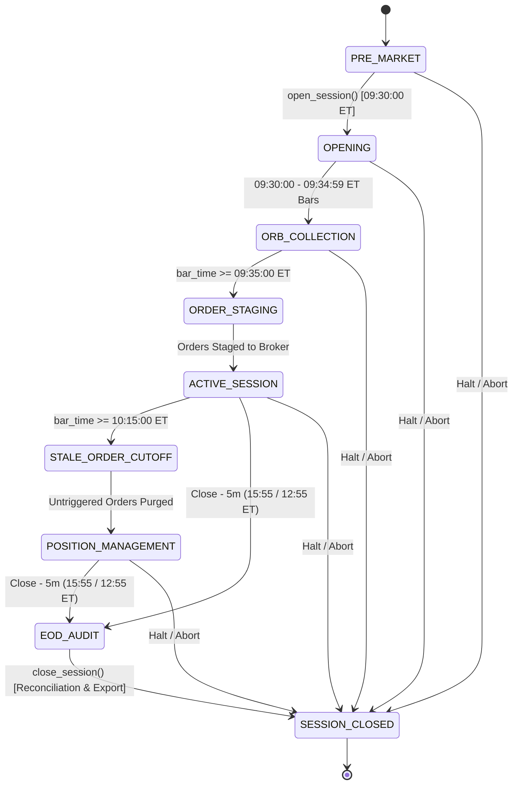

# Stage 2.1 — Session State Machine Transition Audit

## 1. State Machine Architecture

The US real-time paper-trading session executes as a strict, fail-closed finite state machine (FSM). Every state transition is validated against a deterministic transition graph ([`VALID_SESSION_TRANSITIONS`](file:///C:/work/projects/bonde-strategy/src/bonde/live/session.py)). Any unauthorized transition raises a [`SafetyError`](file:///C:/work/projects/bonde-strategy/src/bonde/live/safety.py) and halts execution.

---

## 2. Transition Specifications

| Source State | Target State | Trigger / Prerequisite | Validation & Invariant Enforced |
| :--- | :--- | :--- | :--- |
| `PRE_MARKET` | `OPENING` | `open_session()` called at 09:30:00 ET. | Asserts market regime is valid (`GREEN`, `YELLOW`, or `RED`). Advances `days_held` for overnight positions. |
| `OPENING` | `ORB_COLLECTION` | Ingestion of first 1m bar between 09:30:00 and 09:34:59 ET. | Bars buffered into `orb_bars` dictionary per security. |
| `ORB_COLLECTION` | `ORDER_STAGING` | Bar timestamp reaches $\ge$ 09:35:00 ET. | Calculates actual ORH / ORL for Catalyst candidates; determines Trigger, Stop, and Collar limits. |
| `ORDER_STAGING` | `ACTIVE_SESSION` | All approved orders submitted to broker. | Idempotent staging prevents duplicate orders; immediate disk checkpointing. |
| `ACTIVE_SESSION` | `STALE_ORDER_CUTOFF` | Bar timestamp reaches $\ge$ 10:15:00 ET. | All un-triggered `BUY_STOP_LIMIT` orders are purged. |
| `STALE_ORDER_CUTOFF` | `POSITION_MANAGEMENT` | Broker confirms stale order cancellations. | Focus list shifts exclusively to open position trade management (target, stop, runner). |
| `ACTIVE_SESSION` / `POSITION_MANAGEMENT` | `EOD_AUDIT` | Bar timestamp reaches 5 minutes before close (15:55:00 regular, 12:55:00 early close). | T1 liquidation if $Close \le Entry$; T2 stall liquidation if $Close \le Entry$; cushioned runners exempt. |
| `EOD_AUDIT` | `SESSION_CLOSED` | `close_session()` called at market close. | 3-way reconciliation audit; parity verification; parquet exports. |
| Any Active State | `SESSION_CLOSED` | Unexpected halt or manual stop. | Fail-closed closure; forces reconciliation and telemetry dump. |

---

## 3. Boundary & Edge Case Handling

### 3.1 Pre-Market & Post-Close Guards
- If `process_live_bar()` is invoked when the engine is in `PRE_MARKET`, execution fails closed with `SafetyError("INVALID_SESSION_STATE: Session is in PRE_MARKET state")`.
- If `process_live_bar()` is invoked when the engine is in `SESSION_CLOSED`, execution fails closed with `SafetyError("INVALID_SESSION_STATE: Session is SESSION_CLOSED")`.

### 3.2 Dynamic Early Close Schedule
- On NYSE/NASDAQ early close dates (Black Friday, Christmas Eve, July 3rd), the session closes at 13:00:00 ET.
- The EOD Audit threshold is calculated dynamically:
  $$\text{Audit Time} = \text{Session Close} - 5 \text{ minutes} = 12:55:00 \text{ ET}$$
- Verified that on early close days, EOD audits and liquidations execute at 12:55:00 ET without manual parameter overrides.

### 3.3 DST Timezone Integrity
- All timestamps in bars, quotes, orders, and telemetry are normalized to `America/New_York` (`NY_TZ`).
- Standard RTH window $09:30:00 - 16:00:00$ ET maps accurately to $13:30 - 20:00$ UTC in summer (EDT, UTC-4) and $14:30 - 21:00$ UTC in winter (EST, UTC-5).
